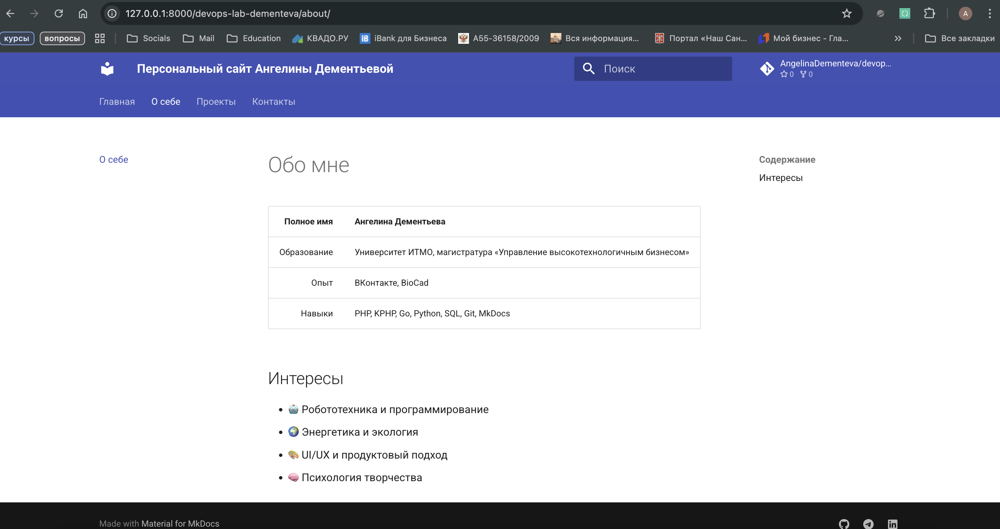
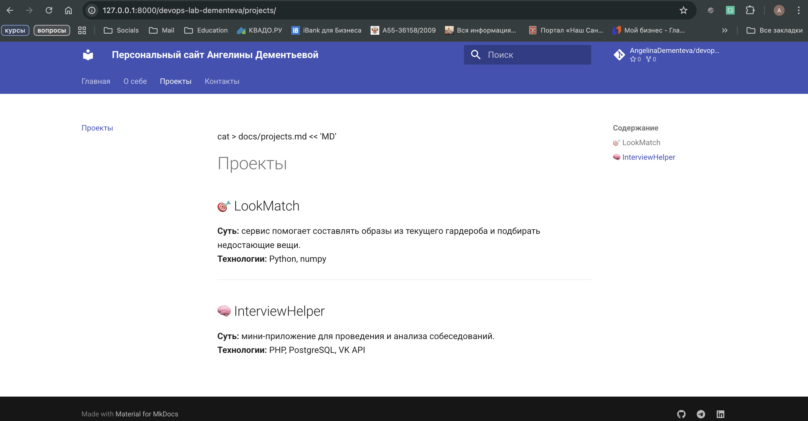
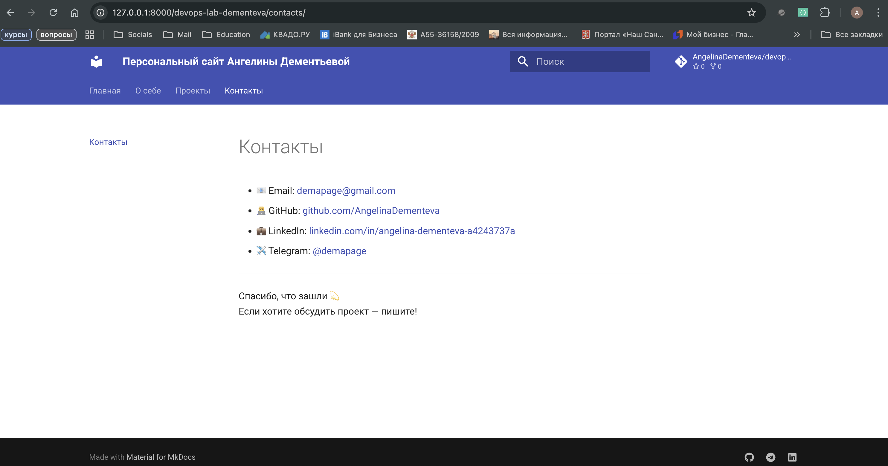

# Курсовая работа  
## Создание персонального сайта с использованием **MkDocs** и темы **Material**

---

### Описание проекта

Данный проект представляет собой персональный сайт, созданный с помощью генератора статических сайтов [**MkDocs**](https://www.mkdocs.org/) и темы [**Material for MkDocs**](https://squidfunk.github.io/mkdocs-material/).

Сайт служит визитной карточкой разработчика и содержит разделы с информацией об авторе, проектах и контактами.

---

### Технологии

- **Python 3.9+**  
- **MkDocs**  
- **Material for MkDocs**  
- **Markdown**  
- **GitHub Pages** — для публикации

---

### Основные страницы

#### Главная
Краткое приветствие и описание деятельности автора.

#### Обо мне
Информация об образовании, опыте работы, навыках и интересах.

#### Проекты
Описание учебных и рабочих проектов, технологий, ссылок на репозитории.

#### Контакты
Актуальные способы связи: GitHub, LinkedIn, Telegram, Email.

---

### Особенности оформления

- Поддержка **тёмной и светлой темы**
- Навигация с вкладками и панелью поиска
- Иконки социальных сетей в футере
- Минималистичный дизайн и адаптивная верстка

---

### Установка и запуск

1. Установить зависимости:
   ``
   pip install mkdocs mkdocs-material
   ``
Запустить локальный сервер:
``mkdocs serve``
Сайт будет доступен по адресу http://127.0.0.1:8000
