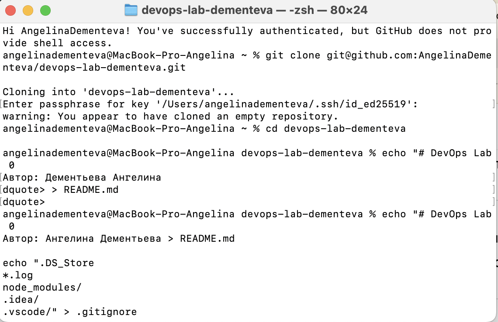
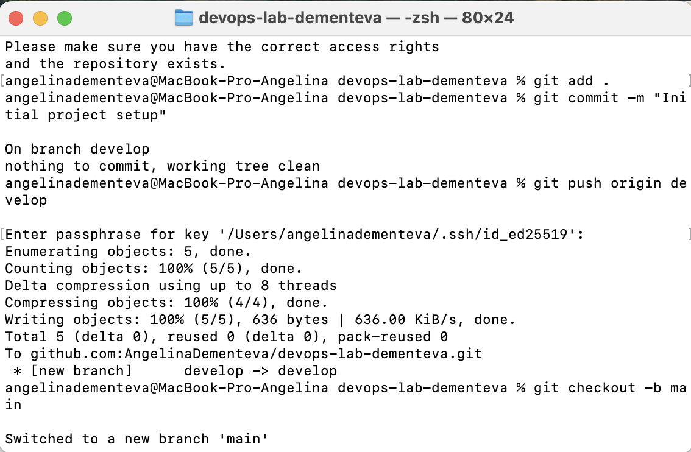

# Лабораторная работа №0

**University:** [ITMO University](https://itmo.ru/ru/)  
**Faculty:** [FICT](https://fict.itmo.ru)  
**Course:** [Introduction in Web Technologies](https://itmo-ict-faculty.github.io/introduction-in-web-tech/)  
**Year:** 2025  
**Group:** U4225  
**Author:** Ангелина Дементьева  
**Lab:** Lab0  
**Date of create:** 29.09.2025  
**Date of finished:** 29.09.2025  

## Описание работы
В этой лабораторной работе я создала репозиторий, настроила SSH-ключи и базовые файлы проекта.

## Результаты
- Репозиторий на GitHub  
- Настроенное окружение  
- Файлы README.md, .gitignore, CONTRIBUTING.md

## Скриншоты

  
  
 
