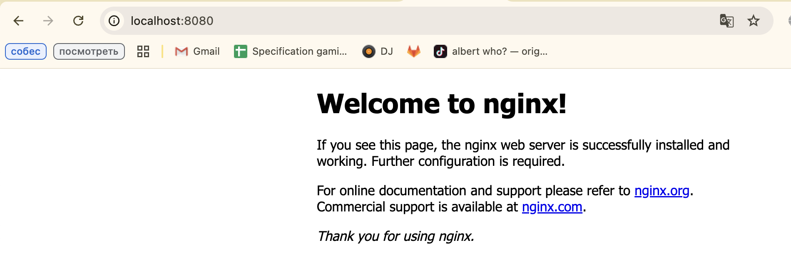
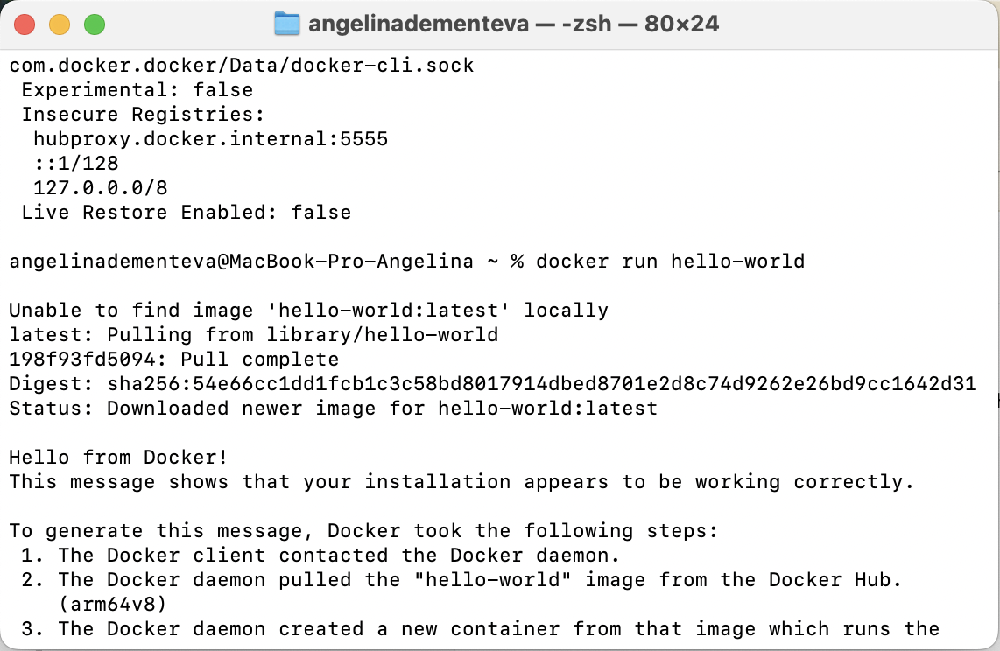

# Лабораторная работа №1

**University:** [ITMO University](https://itmo.ru/ru/)  
**Faculty:** [FICT](https://fict.itmo.ru)  
**Course:** [Introduction in Web Technologies](https://itmo-ict-faculty.github.io/introduction-in-web-tech/)  
**Year:** 2025  
**Group:** U4225  
**Author:** Ангелина Дементьева  
**Lab:** Lab1  
**Date of create:** 29.09.2025  
**Date of finished:** 29.09.2025  

---

## Цель работы
Изучить основы контейнеризации с использованием Docker: установка, работа с образами, контейнерами, томами и создание собственного Dockerfile.

---

## Ход работы
1. Установила Docker и проверила его работу.  
2. Запустила тестовый контейнер `hello-world`.  
3. Изучила базовые команды (`docker ps`, `docker images`, `docker run`).  
4. Запустила контейнер с образом `ubuntu`, установила внутри `curl`.  
5. Развернула веб-сервер на `nginx:alpine`, открыла его в браузере.  
6. Научилась работать с томами (volumes) и проверила сохранность данных.  
7. Выполнила задание со ⭐: создала простое Flask-приложение в Docker.  

---

## Результаты
- Установлен и настроен Docker  
- Освоены базовые команды Docker  
- Получен опыт работы с образами Ubuntu и nginx  
- Реализовано собственное Flask-приложение  

---

## Вывод
Я изучила основы работы с Docker, научилась запускать и управлять контейнерами, работать с томами и собирать собственный Docker-образ.  

---

## Скриншоты

  
  
  
  
  
  
  
  
