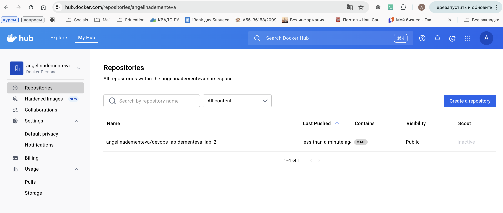
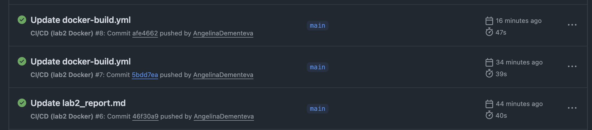
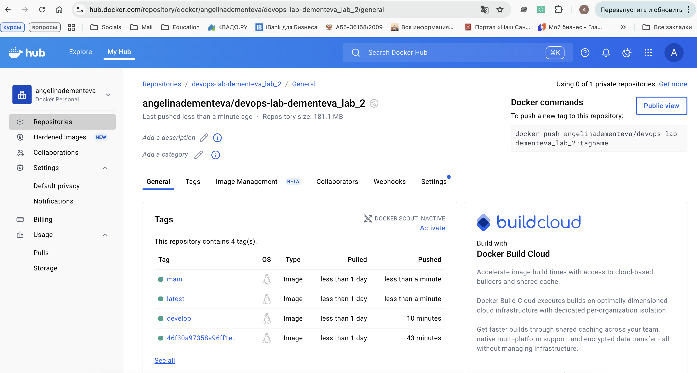
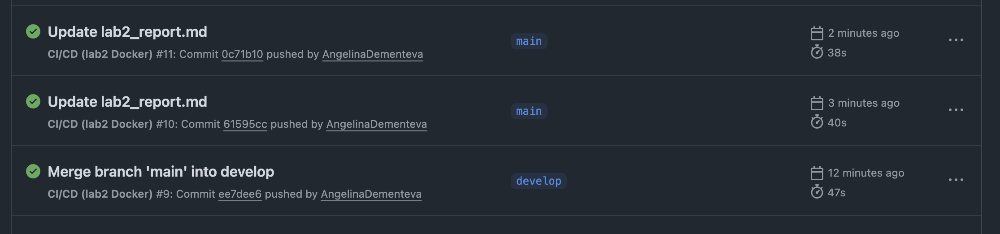

# Лабораторная работа №2

**University:** [ITMO University](https://itmo.ru/ru/)  
**Faculty:** [FICT](https://fict.itmo.ru)  
**Course:** [Introduction in Web Technologies](https://itmo-ict-faculty.github.io/introduction-in-web-tech/)  
**Year:** 2025  
**Group:** U4225  
**Author:** Ангелина Дементьева  
**Lab:** Lab1  
**Date of create:** 29.09.2025  
**Date of finished:** 29.09.2025  

---

## Цель работы
Научиться настраивать автоматизированные пайплайны для сборки Docker-образов, их публикации в Docker Hub и автоматического деплоя при изменении кода.  

---

## Ход работы

### 1. Подготовка проекта
- Создала директорию `lab2` в репозитории `devops-lab-dementeva`.  
- Скопировала файлы из первой лабораторной (`Dockerfile`, `app.py`, `requirements.txt`) в папку `lab2`.  
- Закоммитила изменения и отправила их на GitHub.  

---

### 2. Создание репозитория на Docker Hub
- Зарегистрировала аккаунт на [hub.docker.com](https://hub.docker.com/).  
- Создала новый репозиторий `devops-lab-dementeva_lab_2` для публикации образа.  

  

---

### 3. Настройка GitHub Actions
- В корне проекта создала директорию `.github/workflows/`.  
- Добавила файл `docker-build.yml` со следующим содержимым:  

```yaml
name: CI/CD (lab2 Docker)

on:
  push:
    branches:
      - main
      - develop

jobs:
  build-and-push:
    runs-on: ubuntu-latest

    steps:
      - uses: actions/checkout@v4

      - name: Set up Docker Buildx
        uses: docker/setup-buildx-action@v3

      - name: Login to Docker Hub
        uses: docker/login-action@v3
        with:
          username: ${{ secrets.DOCKER_USERNAME }}
          password: ${{ secrets.DOCKER_PASSWORD }}

      - name: Build & Push Docker image
        uses: docker/build-push-action@v6
        with:
          context: ./lab2
          push: true
          tags: |
            angelinadementeva/devops-lab-dementeva_lab_2:latest
            angelinadementeva/devops-lab-dementeva_lab_2:${{ github.ref_name }}

      - name: Deploy (production)
        if: github.ref == 'refs/heads/main'
        run: echo "Deploying to production server..."

      - name: Deploy (development)
        if: github.ref == 'refs/heads/develop'
        run: echo "Deploying to development server..."
```
---

### 4. Настройка секретов

В настройках GitHub-репозитория добавлены секреты:

DOCKER_USERNAME — логин от Docker Hub

DOCKER_PASSWORD — персональный токен доступа Docker Hub

---

### 5. Тестирование пайплайна

Сделала коммит в ветку main.

Проверила выполнение workflow в разделе Actions.

После успешного запуска Docker-образ появился в репозитории Docker Hub.

  
  

---

### 6. Настройка условного деплоя для разных веток

Создала новую ветку develop:

git checkout -b develop
git push origin develop


Изменила файл lab2_report.md и закоммитила изменения:

echo "Test commit for develop" >> lab2/lab2_report.md
git add lab2/lab2_report.md
git commit -m "docs(lab2): test pipeline on develop"
git push origin develop


Workflow отработал успешно:

при пуше в main → деплой в production

при пуше в develop → деплой в development

  
  


---

### Результаты

В результате лабораторной работы:

Настроен CI/CD пайплайн с GitHub Actions.

Автоматическая сборка и публикация Docker-образа в Docker Hub.

Настроены секреты для безопасной работы.

Реализован условный деплой:

main → production

develop → development
