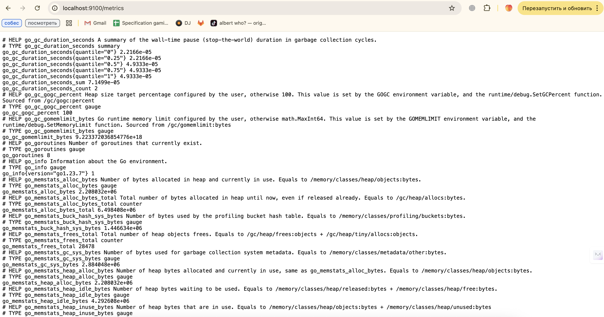
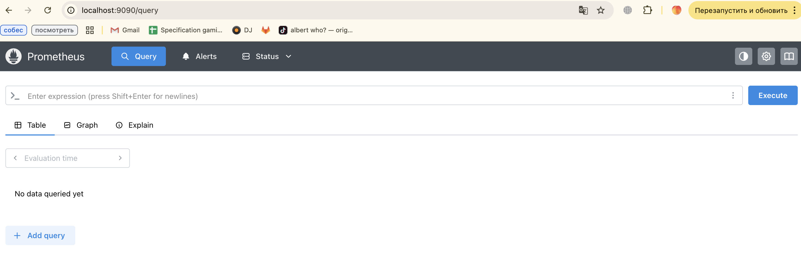
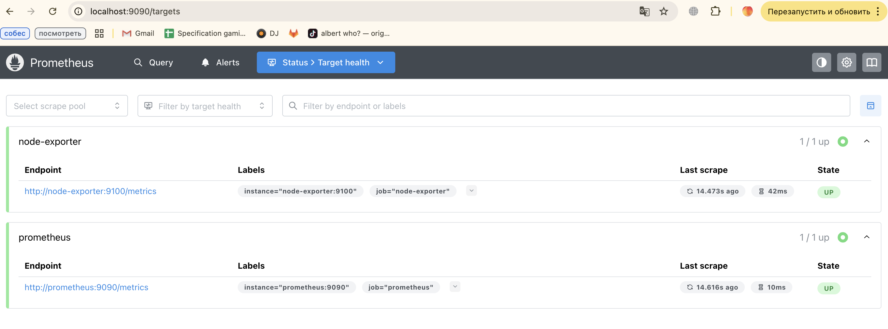
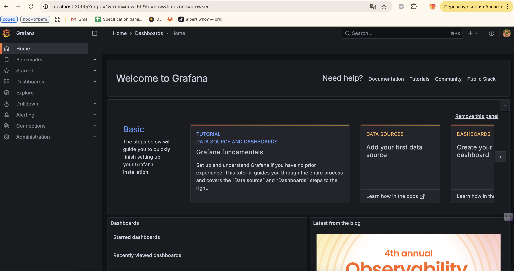
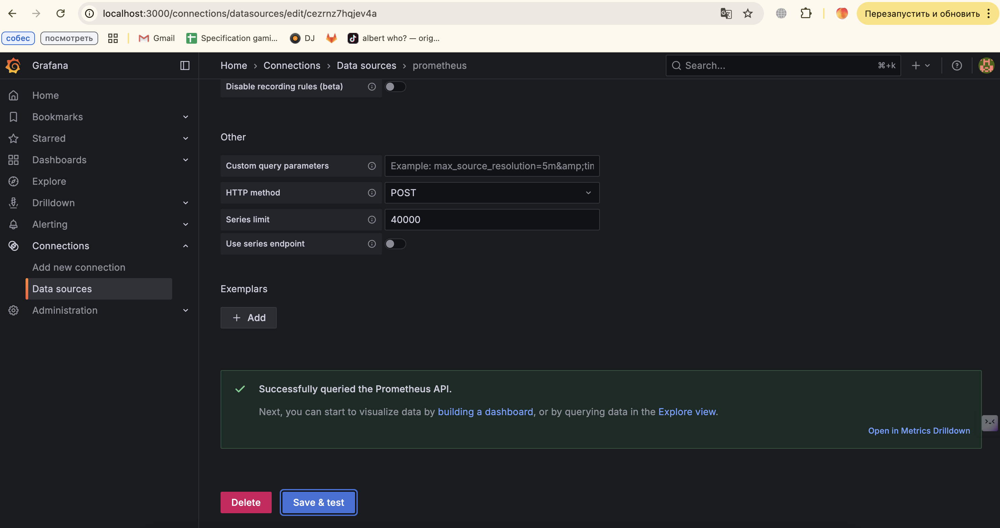
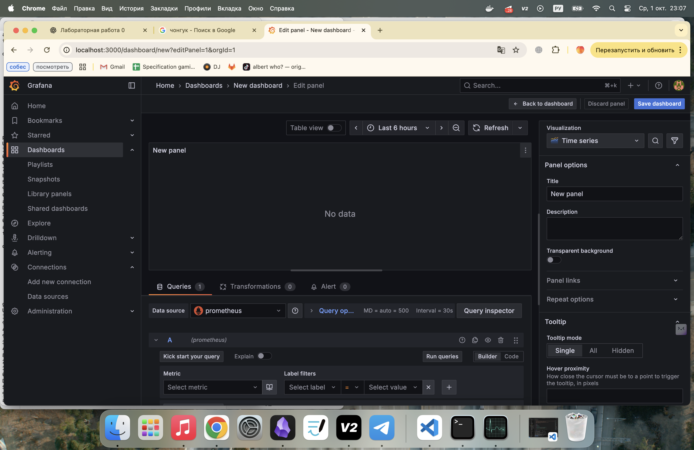
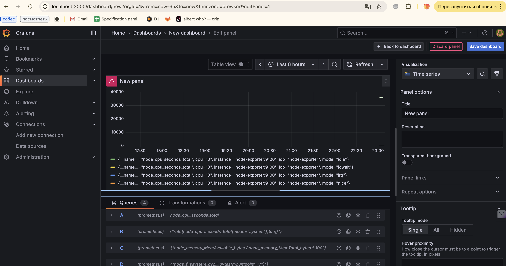
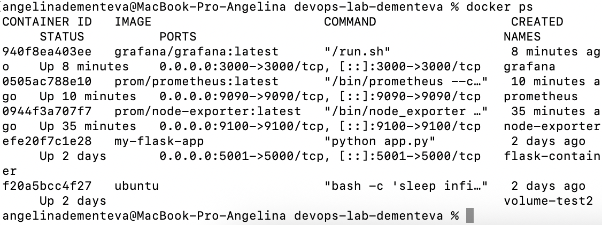

# Лабораторная работа №3

**University:** [ITMO University](https://itmo.ru/ru/)  
**Faculty:** [FICT](https://fict.itmo.ru)  
**Course:** [Introduction in Web Technologies](https://itmo-ict-faculty.github.io/introduction-in-web-tech/)  
**Year:** 2025  
**Group:** U4225  
**Author:** Ангелина Дементьева  
**Lab:** Lab3
**Date of create:** 29.09.2025  
**Date of finished:** 29.09.2025  

---

## Цель работы
Научиться настраивать систему мониторинга, собирать метрики с помощью Prometheus и визуализировать их в Grafana.

---
## Ход выполнения
---

#1. Настройка Node Exporter

Для сбора системных метрик запущен контейнер Node Exporter:

```
docker run -d \
  --name node-exporter \
  --restart=unless-stopped \
  -p 9100:9100 \
  -v "/proc:/host/proc:ro" \
  -v "/sys:/host/sys:ro" \
  -v "/:/rootfs:ro" \
  prom/node-exporter \
  --path.procfs=/host/proc \
  --path.rootfs=/rootfs \
  --path.sysfs=/host/sys \
  --collector.filesystem.mount-points-exclude="^/(sys|proc|dev|host|etc)($$|/)"
```

После запуска проверили доступность метрик по адресу:
http://localhost:9100/metrics

  

## 2. Настройка Prometheus

Создан конфигурационный файл prometheus.yml:

```
global:
  scrape_interval: 15s

scrape_configs:
  - job_name: 'prometheus'
    static_configs:
      - targets: ['localhost:9090']

  - job_name: 'node-exporter'
    static_configs:
      - targets: ['node-exporter:9100']
```

Далее запущен Prometheus в контейнере:
```
docker run -d \
  --name prometheus \
  --restart=unless-stopped \
  -p 9090:9090 \
  -v $(pwd)/prometheus:/etc/prometheus \
  prom/prometheus \
  --config.file=/etc/prometheus/prometheus.yml
```

  
  

## 3. Настройка Grafana

Для визуализации данных запущен контейнер Grafana:
```
docker run -d \
  --name grafana \
  --restart=unless-stopped \
  -p 3000:3000 \
  grafana/grafana
```

Доступ по адресу http://localhost:3000 (логин: admin, пароль: admin).

  

## 4. Подключение Prometheus в Grafana

В настройках Grafana добавлен источник данных Prometheus:

Тип: Prometheus

URL: http://prometheus:9090

  


## 5. Создание дашборда в Grafana

Создан новый дашборд → панель Time Series → добавлены метрики:
```
node_cpu_seconds_total

rate(node_cpu_seconds_total{mode="system"}[5m])

node_memory_MemAvailable_bytes / node_memory_MemTotal_bytes * 100

node_filesystem_avail_bytes{mountpoint="/"}
```
  
  


## 6. Проверка работы контейнеров
```
docker ps
```

  


## Вывод

В ходе лабораторной работы:

Настроен сбор метрик с помощью Node Exporter.

Запущен и сконфигурирован Prometheus для хранения и обработки данных.

Развёрнута Grafana, подключён источник данных и создан дашборд.

Получены графики загрузки CPU, памяти и диска.

Таким образом, была развернута полноценная система мониторинга. 
